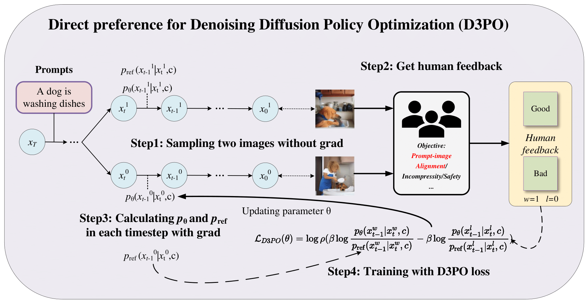
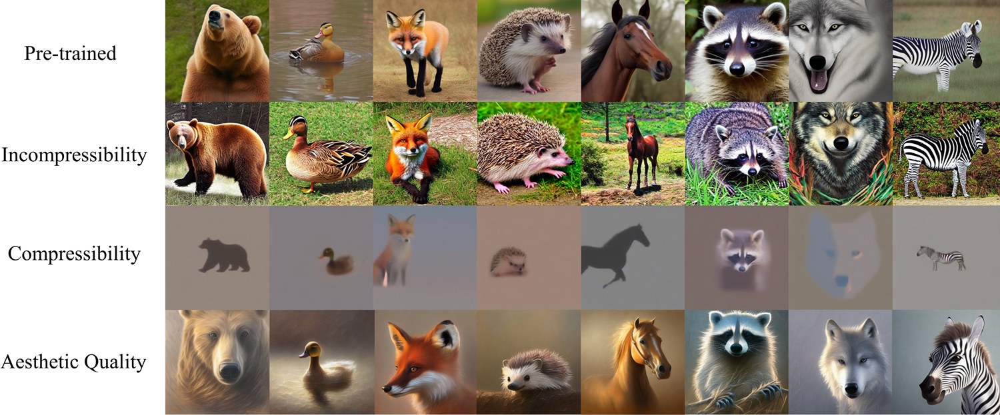
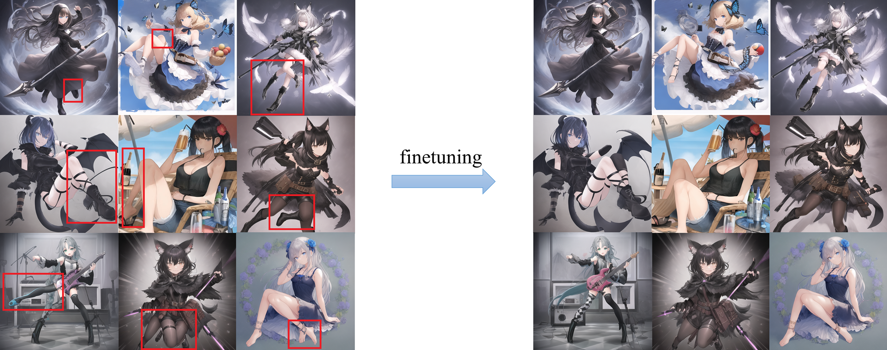

# Direct Preference for Denoising Diffusion Policy Optimization (D3PO)
The official code for the paper [Using Human Feedback to Fine-tune Diffusion Models without Any Reward Model](https://arxiv.org/pdf/2311.13231.pdf). D3PO can directly fine-tune the diffusion model through human feedback without the need to train a reward model. Our repository's code is referenced from [DDPO](https://github.com/kvablack/ddpo-pytorch).




# 1. Requirements
Python 3.10 or a newer version is required to install the necessary dependencies.
```
git clone https://github.com/yk7333/d3po.git
cd d3po
pip install -e .
```

# 2. Usage
We used `accelerate` to facilitate distributed training. Prior to executing our code, it is essential to configure the settings for `accelerate`:
```
accelerate config
```
Depending on your computer's capabilities, you can choose either single or multi-GPU training.

## 2.1 Training with Reward Model (Quantifiable Objectives)
To conduct experiments involving a reward model, you can execute the following command:
```
accelerate launch scripts/rm/train_d3po.py
```
You can modify the prompt function and reward function in `config/base.py` to achieve different tasks.



## 2.2 Training without Reward Model
The training process without a reward model consists of two steps: sampling and training. First, run this command to generate image samples:
```
accelerate launch scripts/sample.py
```
The above command will generate a large number of image samples and save information such as each image's latent representation and prompt. The generated data will be stored in the `/data` directory. Subsequently, based on human feedback, annotations can be applied to the generated images. For this purpose, we deployed a website using [sd-webui-infinite-image-browsing](https://github.com/zanllp/sd-webui-infinite-image-browsing/issues?q=tag), where images can be annotated on a website.

After organizing human feedback results into a JSON file, you'll need to modify *sample_path* in `config/base.py` to the directory containing the image samples and adjust *json_path* to the directory of the JSON file. Then, execute the following command to proceed with the training:
```
accelerate launch scripts/train.py
```
The model will be fine-tuned during training based on human feedback, aiming to achieve the desired results. We conducted experiments to reduce image distortions, enhance image security, and perform prompt-image alignment. You can customize additional fine-tuning tasks based on your specific needs. The dataset for the image distortion experiments can be downloaded [here](https://huggingface.co/datasets/yangkaiSIGS/d3po_datasets/tree/main).



# Citation
```
@article{yang2023using,
  title={Using Human Feedback to Fine-tune Diffusion Models without Any Reward Model},
  author={Yang, Kai and Tao, Jian and Lyu, Jiafei and Ge, Chunjiang and Chen, Jiaxin and Li, Qimai and Shen, Weihan and Zhu, Xiaolong and Li, Xiu},
  journal={arXiv preprint arXiv:2311.13231},
  year={2023}
}
```
